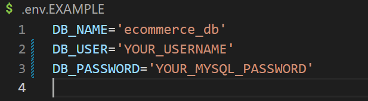

# E-Commerce Back End


## Description

The objective of this project is to create the backend to e-commerce that categorizes all its products and is able to tag each product.

## Table of Contents

- [E-Commerce Back End](#e-commerce-back-end)
  - [Description](#description)
  - [Table of Contents](#table-of-contents)
  - [Installation](#installation)
  - [Usage](#usage)
  - [License](#license)
  - [How to Contribute](#how-to-contribute)
  - [Questions](#questions)

## Installation

Clone repo from <https://github.com/19dbo91/ecommerce-back-end> to your desired folder

## Usage

You can refer to the video at Google Drive: <https://drive.google.com/file/d/1yWTRHPnPmPC3ZvIBJxyhBOia3JhRj5O0/view?usp=sharing>

- Open folder containing freshly downloaded repo
- Open in your IDE
- Rename ``.env.EXAMPLE`` to ``.env``
- Update your credentials in the env for your MySQL log-in



- Run the command in the code block to download dependencies and set up the database
```
npm install
mysql -u <YOUR_USERNAME> -p
```

- In the MySQL shell
```
source db/schema.sql
quit
```


- Back in git bash
```
node seeds/index.js
npm start
```

- Open Insomnia (or your preferred HTTP/API client)
- Open up to base path ``localhost:/3001``
- Add routes to however you want to view/change
/
## License

[MIT License](https://choosealicense.com/licenses/mit/)

## How to Contribute

Contact me

## Questions

Contact me at:

- Github: [19dbo91](https://github.com/19dbo91)
- Email: [bonilla.dustin@gmail.com](mailto:bonilla.dustin@gmail.com)
