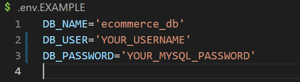
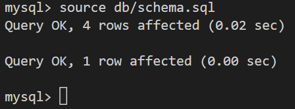

# E-Commerce Back End

## Description

The objective of this project is to create the backend to e-commerce that categorizes all its products and is able to tag each product.

## Table of Contents

- [E-Commerce Back End](#e-commerce-back-end)
  - [Description](#description)
  - [Table of Contents](#table-of-contents)
  - [Installation](#installation)
  - [Usage](#usage)
  - [License](#license)
  - [How to Contribute](#how-to-contribute)
  - [Questions](#questions)

## Installation

Clone repo at

## Usage

Clone repo

Open in IDE and rename ``.env.EXAMPLE`` to ``.env``
Update your credentials in the env for your MySQL log-in

Run the command ``npm install``

Access the MySQL shell and  ``source db/schema.sql``

Quit the MySQL shell

Plant the seeds ``node seeds/index.js``

Start the local server ``npm start``

Open Insomnia (or your preferred HTTP/API client)

Start using and refer to code for routes

## License

[MIT License](https://choosealicense.com/licenses/mit/)

## How to Contribute

Contact me

## Questions

Contact me at:
- Github: [19dbo91](https://github.com/19dbo91)
- Email: [bonilla.dustin@gmail.com](mailto:bonilla.dustin@gmail.com)
